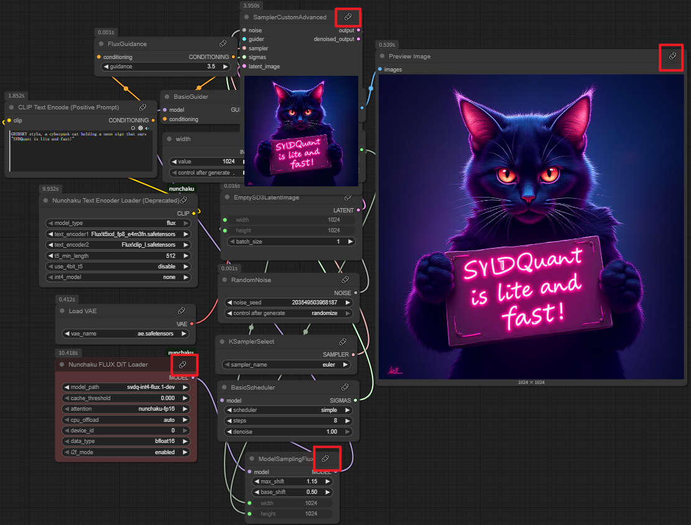

# ComfyUI-uinodesDOC
本插件旨在为 ComfyUI 自定义节点（包括官方和社区节点）提供**图形化文档说明**，让用户可以在界面中直接查看每个节点输入输出、参数解释、用途示例等。

---

**安装教程**

直接在`ComfyUI/custom_nodes`中打开控制命令行CMD进行克隆本项目

~~~bash
git clone https://github.com/uinodes/ComfyUI-uinodesDOC.git
~~~

---

**使用教程**

安装本插件后，每个节点的右上角有一个“回形针”形状，点击即可跳转相应的说明文档界面。

---

**说明**

当前的节点文档功能是基于 [uinodes](https://uinodes.com) 网站中已有的节点文章进行跳转展示的，因此**尚未覆盖所有节点**。部分节点在跳转时可能暂时没有对应的文档说明，说明该节点内容仍在补充中。我们也非常欢迎大家加入[uinodes 共创计划](https://uinodes.com/co-creation/plan)，共同完善网站的节点知识库，助力 ComfyUI 社区成长。
如果该插件对您有所帮助，帮忙点个star👍

